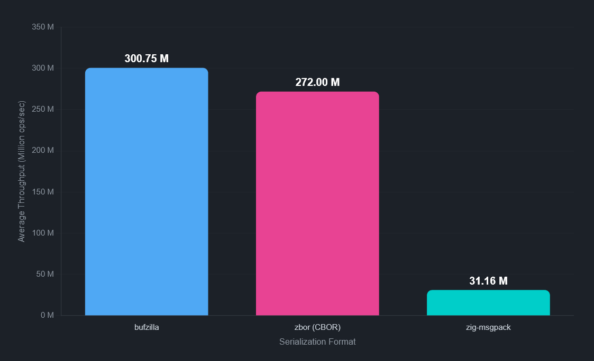

# ⚡ bufzilla

_buffer • zilla_

A compact and fast **binary encoding format** in pure Zig.
Originally based on rxi's article - ["A Simple Serialization System"](https://rxi.github.io/a_simple_serialization_system.html).

bufzilla is ideal for serializing JSON-like objects and arrays, and has the following qualities:

- **Portable** across endianness and architectures.
- **Schemaless**, fully self-describing format; no "pre-compilation" step is necessary.
- **Zero-copy** reads directly from the encoded bytes.
- **Zero internal allocations** while encoding/decoding.
- **Variable length integer encoding** enabled by default, no wasted bytes.
- **Safety** against untrusted inputs with configurable, zero-overhead parsing limits.
- Data can be read _linearly_ without any intermediate representation (eg. trees).
- Format encoded objects as JSON via `Inspect` API.
- Serialize Zig structs and data types recursively.

## Installation

- Zig version: `0.15.2`

```sh
zig fetch https://github.com/theseyan/bufzilla/archive/refs/tags/{VERSION}.tar.gz
```

Copy the hash generated and add `bufzilla` to your `build.zig.zon`:

```zig
.{
    .dependencies = .{
        .bufzilla = .{
            .url = "https://github.com/theseyan/bufzilla/archive/refs/tags/{VERSION}.tar.gz",
            .hash = "{HASH}",
        },
    },
}
```

## Usage

bufzilla simply takes a `std.Io.Writer` interface, and writes encoded data to it. Such a writer can be backed by a growing buffer, a fixed array, a file, or a network socket, etc.

### Writing to a dynamic buffer

Use `std.Io.Writer.Allocating` when you need a dynamically growing buffer:

```zig
const std = @import("std");
const Io = std.Io;
const Writer = @import("bufzilla").Writer;

// Create an allocating writer
var aw = Io.Writer.Allocating.init(allocator);
defer aw.deinit();

// Initialize bufzilla writer
var writer = Writer.init(&aw.writer);

const DataType = struct {
    a: i64,
    b: struct {
        c: bool,
    },
    d: []const union(enum) {
        null: ?void,
        f64: f64,
        string: []const u8,
    },
};

const data = DataType{
    .a = 123,
    .b = .{ .c = true },
    .d = &.{ .{ .f64 = 123.123 }, .{ .null = null }, .{ .string = "value" } },
};

try writer.writeAny(data);

// Get the encoded bytes
const encoded = aw.written();
std.debug.print("Encoded {d} bytes\n", .{encoded.len});
```

### Writing to a fixed buffer

Use `std.Io.Writer.fixed` to prevent dynamic allocations when you know the maximum size upfront:

```zig
var buffer: [1024]u8 = undefined;
var fixed = Io.Writer.fixed(&buffer);

var writer = Writer.init(&fixed);
try writer.writeAny("hello");
try writer.writeAny(@as(i64, 42));

const encoded = fixed.buffered();
```

### Incremental writing

You can also build messages incrementally:

```zig
var writer = Writer.init(&aw.writer);

try writer.startObject();
try writer.writeAny("name");
try writer.writeAny("Alice");
try writer.writeAny("scores");
try writer.startArray();
try writer.writeAny(@as(i64, 100));
try writer.writeAny(@as(i64, 95));
try writer.endContainer(); // end array
try writer.endContainer(); // end object
```

### Typed arrays

When all elements of an array have the same numeric type, and the length is known upfront, you can use a packed typed array which is much more space-efficient:

```zig
const vec = [_]f32{1.0} ** 768;
try writer.writeTypedArray(&vec);
```

### Streaming updates

If you already have an encoded object buffer and want to update a few fields, `Writer.applyUpdates` can stream a new encoding efficiently in a single pass.
Unchanged parts of the buffer are copied directly while only the changed fields are modified.

```zig
const bufzilla = @import("bufzilla");
const Writer = bufzilla.Writer;

// `encoded_bytes` is an existing encoded object

var new_age: i64 = 31;
var new_city: []const u8 = "Berlin";

var updates = [_]Writer.Update{
    Writer.Update.init("age", &new_age),
    Writer.Update.init("profile.address.city", &new_city),
    Writer.Update.init("new_key", &true), // upsert missing keys
    Writer.Update.init("scores[5]", &@as(i64, 100)), // extend arrays, fills gaps with null
};

var out_writer = Writer.init(&aw.writer);
try out_writer.applyUpdates(encoded_bytes, updates[0..]);
```

Note:
- Paths follow the same syntax as `Reader.readPath`.
- `Update.init` takes a pointer; the pointed-to value must stay alive for the duration of `applyUpdates`.
- Missing keys/indices are inserted in the output encoding.
- Errors are returned as `Writer.Error || ReadError || ApplyUpdatesError`.

### Inspecting encoded data as JSON

The `Inspect` API renders encoded bufzilla data as pretty-printed JSON:

```zig
const Inspect = @import("bufzilla").Inspect;

// Output to an allocating writer
var aw = Io.Writer.Allocating.init(allocator);
defer aw.deinit();

var inspector = Inspect(.{}).init(encoded_bytes, &aw.writer, .{});
try inspector.inspect();

std.debug.print("{s}\n", .{aw.written()});
```

Or output directly to a fixed buffer:

```zig
var buffer: [4096]u8 = undefined;
var fixed = Io.Writer.fixed(&buffer);

var inspector = Inspect(.{}).init(encoded_bytes, &fixed, .{});
try inspector.inspect();

std.debug.print("{s}\n", .{fixed.buffered()});
```

Output:

```json
{
    "a": 123,
    "b": {
        "c": true
    },
    "d": [
        123.12300000000000,
        null,
        "value"
    ]
}
```

### Reading encoded data

The `Reader` provides zero-copy access to encoded data:

```zig
const Reader = @import("bufzilla").Reader;

var reader = Reader(.{}).init(encoded_bytes);

// Read values sequentially
const val = try reader.read();
switch (val) {
    .object => { /* iterate object */ },
    .array => { /* iterate array */ },
    .i64 => |n| std.debug.print("int: {d}\n", .{n}),
    .bytes => |s| std.debug.print("string: {s}\n", .{s}),
    // ... other types
}

// Or iterate containers
while (try reader.iterateObject(obj)) |kv| {
    // kv.key and kv.value
}
```

### Path-based queries

The `readPath` method provides fast access to nested values using Javascript-style property paths:

```zig
const Reader = @import("bufzilla").Reader;

var reader = Reader(.{}).init(encoded_bytes);

// Simple property access
const name = try reader.readPath("name");

// Nested properties
const city = try reader.readPath("address.city");

// Array indexing
const first = try reader.readPath("items[0]");

// Mixed paths
const score = try reader.readPath("users[5].scores[0]");

// Quoted keys
const value = try reader.readPath("data['key.with.dots']");

// Returns null if path doesn't exist
const missing = try reader.readPath("nonexistent.path"); // null
```

For reading many paths efficiently, use `readPaths` to scan the buffer once:

```zig
var queries = [_]bufzilla.PathQuery{
    .{ .path = "name" },
    .{ .path = "address.city" },
    .{ .path = "items[0]" },
};

try reader.readPaths(queries[0..]);

const name = queries[0].value;
const city = queries[1].value;
const first_item = queries[2].value;
```

You can find more examples in the [unit tests](https://github.com/theseyan/bufzilla/tree/main/test).

### Safety against untrusted inputs

When reading untrusted data, bufzilla provides configurable limits at compile time to prevent infinite recursion/stack overflow errors, with negligible performance loss.

```zig
const Reader = @import("bufzilla").Reader;

// Default limits
var reader = Reader(.{}).init(data);

// Custom limits
var reader = Reader(.{
    .max_depth = 50,                    // Max nesting depth
    .max_bytes_length = 1024 * 1024,    // Max string/binary blob size
    .max_array_length = 10_000,         // Max array elements
    .max_object_size = 10_000,          // Max object key-value pairs
}).init(data);

// Unlimited depth
var reader = Reader(.{ .max_depth = null }).init(data);
```

| Limit | Default | Error |
|-------|---------|-------|
| `max_depth` | 2048 | `MaxDepthExceeded` |
| `max_bytes_length` | unlimited | `BytesTooLong` |
| `max_array_length` | unlimited | `ArrayTooLarge` |
| `max_object_size` | unlimited | `ObjectTooLarge` |

**Notes:**
- `max_array_length` and `max_object_size` require `max_depth` to be set. Setting them with `max_depth = null` is a compile error.
- Reader internally allocates a stack buffer of size `max_depth` for iteration counters when array/object limits are enabled. Keep `max_depth` reasonable (default 2048 uses ~16KB).

The `Inspect` API also accepts limits as a parameter:

```zig
var inspector = Inspect(.{ .max_depth = 100 }).init(data, &writer, .{});
```

## Gotchas

- As a self-describing format, field names (keys) are present in the encoded result which can inflate the encoded size compared to other schemaful encoding formats.

## Testing

Comprehensive unit tests are present in the `test/` directory.

```bash
zig build test
```

## Benchmarks

Run the [benchmark suite](https://github.com/theseyan/bufzilla/blob/main/bench/main.zig) with `zig build bench -Doptimize=ReleaseFast`.

**bufzilla is competitive in performance with similar self-describing binary formats, and in most cases, much faster.**

*Avg. throughput (ops/sec): [bufzilla](https://github.com/theseyan/bufzilla) vs [zbor](https://github.com/r4gus/zbor) vs [zig-msgpack](https://github.com/zigcc/zig-msgpack)*

Results on x86_64 Linux, Ryzen 7 9700X CPU:
```
Basic Types:
--------------------------------------------------------------------------------
                              Null Write |  1000000 iterations |        0 ns/op |        0 ops/sec
                               Null Read |  1000000 iterations |        2 ns/op | 500000000 ops/sec
                              Bool Write |  1000000 iterations |        0 ns/op |        0 ops/sec
                               Bool Read |  1000000 iterations |        2 ns/op | 500000000 ops/sec
                         Small Int Write |  1000000 iterations |        2 ns/op | 500000000 ops/sec
                          Small Int Read |  1000000 iterations |        2 ns/op | 500000000 ops/sec
                         Large Int Write |  1000000 iterations |        2 ns/op | 500000000 ops/sec
                          Large Int Read |  1000000 iterations |        2 ns/op | 500000000 ops/sec
                             Float Write |  1000000 iterations |        2 ns/op | 500000000 ops/sec
                              Float Read |  1000000 iterations |        1 ns/op | 1000000000 ops/sec

Strings:
--------------------------------------------------------------------------------
            Short String Write (5 bytes) |   500000 iterations |        4 ns/op | 250000000 ops/sec
             Short String Read (5 bytes) |   500000 iterations |        2 ns/op | 500000000 ops/sec
        Medium String Write (~300 bytes) |   100000 iterations |        4 ns/op | 250000000 ops/sec
         Medium String Read (~300 bytes) |   100000 iterations |        2 ns/op | 500000000 ops/sec

Binary Data:
--------------------------------------------------------------------------------
           Small Binary Write (32 bytes) |   500000 iterations |        6 ns/op | 166666666 ops/sec
            Small Binary Read (32 bytes) |   500000 iterations |        2 ns/op | 500000000 ops/sec
                Large Binary Write (1KB) |   100000 iterations |        9 ns/op | 111111111 ops/sec
                 Large Binary Read (1KB) |   100000 iterations |        2 ns/op | 500000000 ops/sec

Arrays:
--------------------------------------------------------------------------------
         Small Array Write (10 elements) |   100000 iterations |       25 ns/op | 40000000 ops/sec
          Small Array Read (10 elements) |   100000 iterations |       27 ns/op | 37037037 ops/sec
       Medium Array Write (100 elements) |    50000 iterations |      260 ns/op |  3846153 ops/sec
        Medium Array Read (100 elements) |    50000 iterations |      243 ns/op |  4115226 ops/sec

Objects (Maps):
--------------------------------------------------------------------------------
         Small Object Write (10 entries) |   100000 iterations |      143 ns/op |  6993006 ops/sec
          Small Object Read (10 entries) |   100000 iterations |      116 ns/op |  8620689 ops/sec
        Medium Object Write (50 entries) |    50000 iterations |      712 ns/op |  1404494 ops/sec
         Medium Object Read (50 entries) |    50000 iterations |      629 ns/op |  1589825 ops/sec

Complex Structures:
--------------------------------------------------------------------------------
                  Nested Structure Write |    50000 iterations |       36 ns/op | 27777777 ops/sec
                   Nested Structure Read |    50000 iterations |       71 ns/op | 14084507 ops/sec
                       Mixed Types Write |    50000 iterations |       31 ns/op | 32258064 ops/sec
                        Mixed Types Read |    50000 iterations |       57 ns/op | 17543859 ops/sec

Struct Serialization:
--------------------------------------------------------------------------------
                     Simple Struct Write |   100000 iterations |       29 ns/op | 34482758 ops/sec
                      Simple Struct Read |   100000 iterations |       46 ns/op | 21739130 ops/sec
                    Complex Struct Write |    50000 iterations |      136 ns/op |  7352941 ops/sec
                     Complex Struct Read |    50000 iterations |      272 ns/op |  3676470 ops/sec
```
